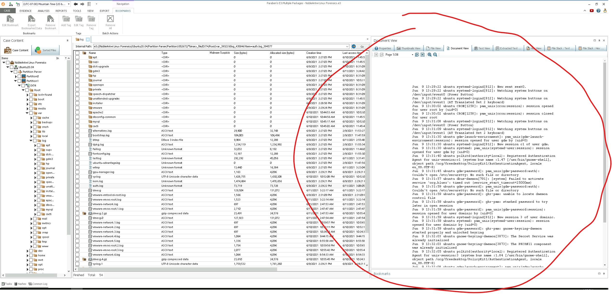
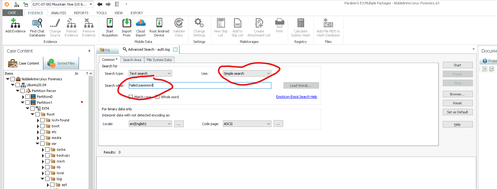
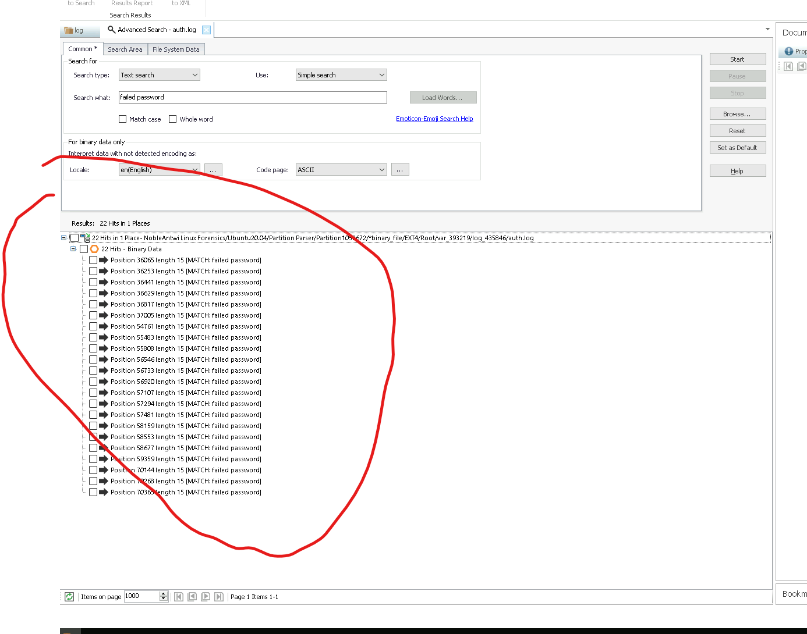
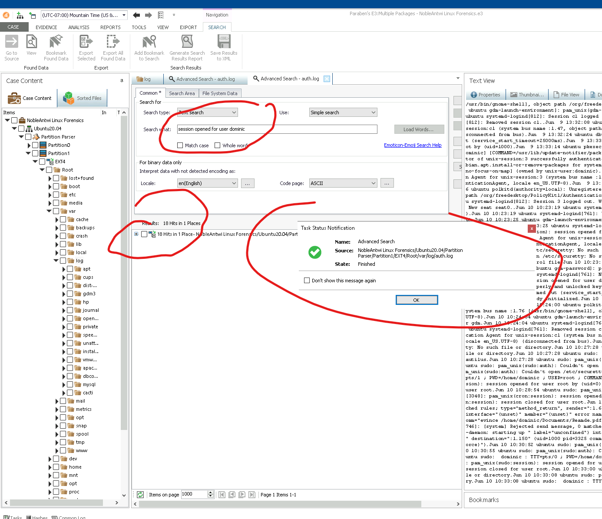
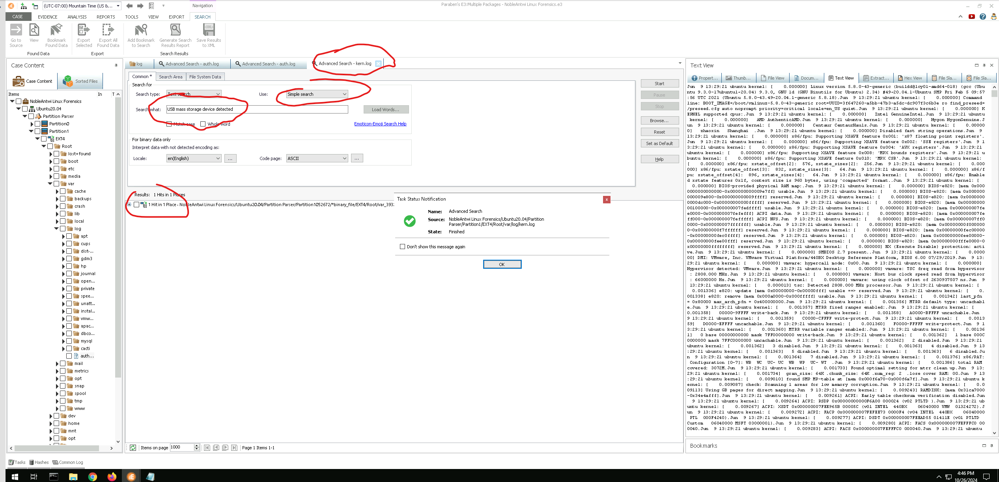

# Conducting Forensic Investigations on Linux Systems

## Introduction

Linux is a free, open-source operating system, making its source code accessible to anyone interested in modifying, repackaging, or distributing it. Despite being freely available, Linux is a powerful, high-performance system widely used, particularly for infrastructure and web servers. For forensic investigators, this means Linux-based evidence is frequently encountered when examining servers and network infrastructure, just as Windows-based evidence is commonly seen on desktops and laptops.

Notably, Linux is also the foundation of Android, the most prevalent mobile operating system globally, holding over 72% of the market share. While mobile forensics lies beyond this lab’s scope, many skills practiced here can be extended to Android devices.

An essential component of Linux is the interactive interface, known as the shell. The shell interprets commands from the keyboard and relays them to the operating system. Linux offers two main shells: a graphical user interface (GUI) and a command-line interface (CLI). Though users familiar with Windows or macOS may find the GUI approachable, the command-line interface offers unmatched flexibility and control, crucial for forensic analysis on a Linux system.

Here’s a personalized, direct format for these instructions:

---

## Identify Login Attempts on a Linux Drive Image

### Scenario

As a junior forensic investigator at a consulting firm specializing in cybercrime investigations for government agencies, cryptocurrency businesses, and financial institutions, I have been assigned a new case for Harper and Associates.

Harper and Associates is a prominent financial investment firm managing billions of dollars in assets. Recently, their security team detected suspicious activity on one of their critical Linux servers. They suspect an intruder attempted unauthorized access using the credentials of a legitimate user. To address this incident, Harper and Associates has enlisted our firm to gather evidence of any such intrusion.

For this investigation, I have been provided with a disk image of the compromised Linux system, captured after the suspected intrusion.

In the following steps, I will use Paraben’s E3 to import the Linux drive image and examine the system’s log files to identify login attempts and uncover any indicators of unauthorized access.

## Case Creation and Initial Log Analysis

After launching Paraben’s E3, I created a new case titled **NobleAntwi Linux Forensics**. The primary objective is to investigate potential unauthorized access attempts on a Linux server suspected of being compromised.

1. **Drive Image Import**:  
   I navigated to the provided Ubuntu 20.04 disk image file and imported it into the newly created case. Once imported, I located the critical directory path for log analysis:

   ``` bash
   Linux Forensics\Ubuntu20.04\Partition Parser\Partition1\EXT4\Root\var\log
   ```


2. **Accessing the auth.log File**:  
   Within the `/var/log` directory, I identified and selected the **auth.log** file in the Data Viewer pane of E3. This file, known as the authorization log, records activity related to system authorization processes. Specifically, it logs password entries (both successful and failed), usage of the `sudo` command, remote login attempts, and more. For forensic purposes, the **auth.log** is essential for investigating recent login attempts, unauthorized access attempts, and related activities on the system.

3. **Document View Inspection**:  
   Upon opening the auth.log file in the Document Viewer, I observed that the log spanned a substantial length of 26 pages. Given the volume of data, manually reading through the file would be inefficient and prone to oversight.
   

4. **Utilizing Advanced Search for Login Attempts**:  
   To streamline the analysis, I used E3's **Advanced Search** functionality. Specifically, I queried the auth.log file for the term **“failed password”**, a phrase commonly logged in Linux distributions to indicate failed login attempts. While phrasing can vary slightly across distributions, “failed” and “password” are typically present when documenting unsuccessful login attempts. This search technique allows for efficient identification of potential unauthorized access events within the auth.log.

5. **Setting Up the Search**:  
   In the Data Viewer, I right-clicked the **auth.log** file and selected **Advanced Search** from the context menu, which opened the search pane in the center console. Within the search pane, I entered **“failed password”** as the search term in the *Search what* field, chose **Simple search** from the *Use* menu, and clicked **Start** to initiate the search.
   

6. **Reviewing Search Results**:  
   The search yielded **22 Hits in 1 Place**, with **22 Hits – Binary Data headers**. I then proceeded to examine each individual result, drilling down into each instance to locate specific failed login attempts recorded in the **auth.log**.


7. **Identifying Key Findings – Failed Login Attempts**:  
   Among the results, I identified multiple unsuccessful login attempts that fell outside of Harper and Associates’ typical work hours (7:00 PM to 9:00 AM). This unusual activity occurred on June 11, indicating a high likelihood of malicious intent, particularly as legitimate users rarely attempt access with invalid credentials during off-hours.  

### Unauthorized Login Activity Summary

   **User**: Noel  

- **Ports**: 14444 and 3521  
- **Source IP**: 192.168.78.1  
- **Number of Attempts**: A total of 12 attempts were recorded for Noel, with 6 attempts on port 14444 and another 6 on port 3521.  
- **Date/Time Range of Attempts**: June 11, between 00:57:08 and 05:06:50  

   **User**: Dominic  
- **Ports**: 4663 and 3417  
- **Source IP**: 192.168.78.1  
- **Number of Attempts**: A total of 8 attempts were recorded for Dominic, with 5 attempts on port 4663 and 3 attempts on port 3417.  
- **Date/Time Range of Attempts**: June 11, between 05:07:29 and 05:38:32  

   Both users’ accounts showed a pattern of failed access attempts originating from the same IP address and within a suspicious timeframe, supporting the hypothesis of malicious activity on the server.

## Follow-Up Search for Successful Login Attempts

Following the analysis of failed login attempts, I proceeded to investigate whether any successful logins were recorded for the same user accounts. Using Paraben’s E3 Advanced Search, I adjusted the search term to **“session opened for user [username]”**, replacing *[username]* with *Noel* and *Dominic*, and conducted individual searches.

1. **Search Results for Noel**:  
   There were **no successful login entries** for Noel, corroborating the lack of valid credentials for this user.

2. **Search Results for Dominic**:  
   Dominic, however, showed several successful login events. Notably, the most recent successful login for Dominic was recorded on **June 11 at 05:23:03**. This successful login amidst the failed attempts indicates a potentially unauthorized access.



Here's a detailed and professional rewrite of this stage of your investigation, with added context for clarity and depth:

---

## Identification of Software Installations on a Linux Drive Image

Having uncovered evidence that a legitimate user account, specifically that of Dominic, made repeated unsuccessful login attempts outside of regular working hours—ultimately culminating in a successful login—it became imperative to explore the nature of the account compromise. Given the timing of these events on June 11, the possibility that the legitimate user was merely attempting to access the production file server in the early hours of the morning, perhaps after a restless night, appears less plausible. Instead, it raises concerns that an intruder may have exploited a compromised user account.

To advance this investigation, I focused on identifying any anomalies that could shed light on how the intruder obtained the valid user credentials initially. This would provide crucial context for understanding the breach and its implications.

### Searching for Software Installations

To further my inquiry, I utilized the advanced search functionality within E3 to search for instances of the **apt-get install** command within the **auth.log** file.

- **Understanding apt-get**:  
  The **Advanced Package Tool (APT)** is a widely used software management system in Linux distributions that simplifies the process of installing and removing software packages. The **apt-get install** command specifically allows users to install new packages onto the Linux system. As a forensic investigator, searching for records of this command in the auth.log is a strategic approach, as it can reveal what software has been recently installed, providing insights into potential unauthorized modifications to the system.

### Results of the Software Installation Search

Upon executing the search for **apt-get install**, I meticulously reviewed the instances where this command had been executed. Among the results, one particular installation command stood out due to its unusual nature.


- **Suspicious Installation of logkeys**:  
  The command **apt-get install logkeys** was executed on **June 10 at 10:35:36**. Logkeys is a known Linux keylogger tool designed to record every keystroke made on the system. This kind of software poses a significant security risk, as it can capture sensitive information, including passwords, private messages, and other critical user input, effectively enabling an intruder to harvest credentials or other confidential data without the user's knowledge.

  - **Keylogger Functionality**:  
    Logkeys operates by logging all keystrokes made by the user, which can later be retrieved by the attacker. This capability suggests that the individual who executed this command had malicious intent, likely aiming to monitor user activity and capture credentials for further exploitation.

### Privilege Escalation Indicators

Notably, the **apt-get install** command was executed using the **sudo** command, indicating that the individual who installed the software possessed access to an account with **root privileges**. This access is indicative of a significant security breach, as it suggests that the intruder not only gained entry into the system using compromised user credentials but also had sufficient permissions to install potentially harmful software.

### Conclusion and Next Steps

At this juncture, the evidence points toward a sophisticated attack vector involving the compromise of a legitimate user account and subsequent installation of keylogging software. This alarming discovery necessitates a deeper investigation into how the intruder acquired these credentials in the first place and whether any additional unauthorized actions were taken on the system.

## Identification of External Drive Attachments on a Linux Drive Image

The findings from the initial investigation have confirmed the suspicions of the Harper and Associates security team: an intruder successfully gained access to the Linux server, potentially aided by an internal collaborator who installed network monitoring and keylogging software. This collaboration raises critical concerns about the security of the server, especially given the multiple failed login attempts and the subsequent successful access on June 11.

Following the report of these findings, the security team revealed that the compromised server is part of an older system located in a server closet at the company’s Boston office. The presence of an internal collaborator raises the alarming possibility of physical access to the server. In fact, the security footage reviewed by the team revealed that a hooded individual accessed the server closet approximately two hours before the logs indicated the installation of the keylogger. This evidence strongly suggests that the physical security of the server has been compromised, necessitating a thorough examination of the drive image for any evidence of external drive attachments.

### Investigating the kern.log File

To search for any records of physical drive connections, I accessed the **kern.log** file, which logs kernel messages, including events related to hardware changes. Recognizing the significance of this file in tracking USB device activity, I initiated an advanced search.

1. **Executing the Search**:  
   I located the **kern.log** file in the Data Viewer and performed an advanced search for the phrase **“USB mass storage device detected.”**

2. **Results of the Search**:  
   The search yielded an entry indicating that a USB storage device was connected to the system at **10:24:12 on June 10**. The device was identified with the serial number **FBI1405291710344**.

## Identify Disk Imaging on a Linux Drive Image

The security team at Harper and Associates provided additional insights. They suspected that the insider threat who accessed the server closet may have created a disk image of the server's hard drive and subsequently used a USB drive to exfiltrate it. To corroborate this theory, I needed to review the evidence drive again and look for any log entries indicating that a disk copy command was executed.

### Researching the dd Command

The **`dd`** command is a powerful tool in Unix-like operating systems, primarily used for low-level copying and conversion of raw data. It allows users to create disk images, clone disks, and perform data recovery. The syntax for the `dd` command generally follows this structure:

```bash
dd if=<input file> of=<output file> [options]
```

- **if= <>**: Specifies the source file or device (in this case, the hard drive).
- **of=<output file>**: Specifies the destination file or device (where the image will be saved).
- **bs=<block size>**: Sets the size of the blocks read and written (optional).
- **status=<status options>**: Controls the level of information shown during the operation (optional).

### Running the Advanced Search

Using E3's Advanced Search functionality, I searched the **`/var/log`** folder for any records of the `dd` command being executed. The search criteria included **`dd if=`**, which would help identify any instances where the `dd` command was used to copy data from the server.


### Findings

The search yielded the following command:

```bash
/usr/bin/dd if=/dev/sda of=/media/dominic/data/Ubuntu20.04.image bs=4096 status=progress
```

### Explanation of the Command

- **`/usr/bin/dd`**: This indicates the path to the `dd` executable, which is commonly located in the `/usr/bin` directory.
- **`if=/dev/sda`**: Here, `/dev/sda` represents the source disk. In a Linux environment, `/dev/sda` typically denotes the primary hard drive, which contains the operating system and user data.
- **`of=/media/dominic/data/Ubuntu20.04.image`**: This specifies the destination for the disk image. The command indicates that the data from the source disk is being written to a file named `Ubuntu20.04.image`, located in the `data` directory on a mounted media associated with the user `dominic`.
- **`bs=4096`**: This option sets the block size for the read and write operations to 4096 bytes, which can optimize the speed of the copying process.
- **`status=progress`**: This option enables the display of ongoing progress during the execution of the command, providing real-time feedback about the amount of data processed.

### Implications of the Command

The execution of this `dd` command indicates a clear intent to create a complete disk image of the server’s hard drive. This activity aligns with the earlier findings of unauthorized access and the potential exfiltration of sensitive data. The implications are significant:

1. **Evidence of Malicious Activity**: The creation of a disk image suggests that the insider was likely attempting to capture all data from the server, including sensitive financial records and possibly user credentials, for further exploitation.

2. **Risk of Data Breach**: If the disk image was successfully exfiltrated via the USB device, it could lead to a substantial data breach, with far-reaching consequences for the organization and its clients.

3. **Necessity for Incident Response**: The evidence gathered from this command highlights the need for immediate incident response measures, including the preservation of existing logs, the investigation of any other potentially compromised systems, and a review of access controls to prevent further unauthorized activities.

The identification of the `dd` command and its implications provides critical insight into the ongoing investigation. The evidence suggests a coordinated effort by the insider threat to capture and potentially exfiltrate sensitive data from the server. Moving forward, further analysis will be crucial to understand the full extent of the breach and to develop strategies to mitigate future risks.

Based on the comprehensive forensic analysis conducted on the Linux drive image from Harper and Associates' compromised server, I can provide the following conclusion to the case file:

## Case Conclusion: Unauthorized Access and Data Exfiltration at Harper and Associates

### Summary of Findings

The forensic investigation of the Linux server at Harper and Associates has uncovered strong evidence of a sophisticated insider threat operation, resulting in unauthorized access and potential data exfiltration. The key findings are as follows:

1. **Unauthorized Login Attempts**:
   - Multiple failed login attempts were recorded for two user accounts: Noel and Dominic.
   - These attempts occurred outside normal business hours on June 11, between 00:57:08 and 05:38:32.
   - All attempts originated from the same IP address: 192.168.78.1.

2. **Successful Unauthorized Access**:
   - A successful login for Dominic's account was recorded on June 11 at 05:23:03, following multiple failed attempts.

3. **Malicious Software Installation**:
   - The command `sudo apt-get install logkeys` was executed on June 10 at 10:35:36, indicating the installation of a keylogging software.
   - This installation required root privileges, suggesting a significant compromise of system security.

4. **Physical Security Breach**:
   - Security footage confirmed unauthorized physical access to the server closet approximately two hours before the keylogger installation.

5. **External Drive Connection**:
   - A USB mass storage device with serial number FBI1405291710344 was detected connecting to the system on June 10 at 10:24:12.

6. **Disk Imaging Activity**:
   - Evidence of a disk imaging command was found:

     ```bash
     /usr/bin/dd if=/dev/sda of=/media/dominic/data/Ubuntu20.04.image bs=4096 status=progress
     ```

   - This command created a complete image of the server's hard drive, potentially facilitating data exfiltration.

### Conclusion

The evidence strongly suggests a coordinated and sophisticated attack on Harper and Associates' Linux server. The sequence of events indicates that an insider threat, possibly with the assistance of an external actor, gained physical access to the server, installed keylogging software, captured user credentials, and subsequently used these credentials to create and exfiltrate a complete disk image of the server.

This breach poses a severe risk to Harper and Associates, potentially compromising sensitive financial data, client information, and internal communications. The creation of a full disk image suggests that the attacker had access to all data stored on the server, which could lead to significant reputational damage and financial losses if misused or exposed.

### Recommendations

1. **Immediate Incident Response**: Initiate a full-scale incident response plan to contain and mitigate the breach.

2. **System Isolation**: Isolate the compromised server to prevent further unauthorized access or data exfiltration.

3. **Credential Reset**: Force a reset of all user credentials across the organization's systems.

4. **Enhanced Monitoring**: Implement enhanced monitoring of all systems, particularly focusing on after-hours access attempts and software installations.

5. **Physical Security Audit**: Conduct a thorough audit of physical security measures, especially for areas containing critical infrastructure.

6. **Data Recovery and Analysis**: Attempt to recover any data that may have been exfiltrated and analyze it to understand the full scope of the breach.

7. **Employee Training**: Enhance cybersecurity awareness training for all employees, emphasizing the importance of physical security and the risks of insider threats.

8. **Legal and Regulatory Compliance**: Consult with legal counsel to ensure compliance with any relevant data breach notification laws and regulations.

9. **Security Infrastructure Review**: Conduct a comprehensive review of the organization's security infrastructure, including access controls, network segmentation, and encryption practices.

10. **Ongoing Forensic Analysis**: Continue in-depth forensic analysis to uncover any additional compromised systems or lingering threats within the network.

This incident underscores the critical importance of maintaining robust cybersecurity measures, including both digital and physical security protocols. Harper and Associates must take immediate and decisive action to address this breach and strengthen its overall security posture to prevent similar incidents in the future.

---
---

## Key Forensic Information Sources in Linux Systems

Forensic investigators can uncover valuable evidence by examining specific directories and utilizing certain commands in Linux systems. Here's an overview of important locations and commands:

### 1. Contents of Key Directories

#### /bin Directory

- Essential system binaries and executables
- Common user commands (e.g., ls, cp, mv)
- Shell interpreters (e.g., bash, sh)
- Critical system utilities (e.g., mount, umount, ping)

#### /etc Directory

- System-wide configuration files
- User and group information (/etc/passwd, /etc/group)
- Network configuration (/etc/hosts, /etc/resolv.conf)
- Startup and shutdown scripts
- Application configuration files

#### /var Directory

- Variable data files
- System logs (/var/log)
- Temporary files (/var/tmp)
- Spool directories for mail and print queues
- Crash dumps (/var/crash)
- Package management data (/var/lib/dpkg or /var/lib/rpm)

#### /proc Directory

- Virtual filesystem providing process and kernel information
- Current system state
- Running processes and their details
- Hardware information
- Kernel parameters

### 2. Using Key Commands for Forensic Investigation

#### dmesg Command

- Kernel ring buffer messages
- Hardware detection and driver loading information
- System boot messages
- Kernel-level errors and warnings

#### fsck Command

- File system consistency check results
- Evidence of file system corruption
- Repair actions taken on the file system
- Inode and block allocation information

#### history Command

- User command history
- Timestamps of executed commands (if enabled)
- Evidence of user activities and potential malicious actions
- Insight into user behavior and system interaction

#### lsof Command

- List of open files and the processes using them
- Network connections and their associated processes
- Deleted files still held open by processes
- Evidence of data exfiltration or unauthorized access

#### ps Command

- Current running processes
- Process hierarchy and relationships
- Resource usage by processes
- Potentially malicious or suspicious processes

#### netstat or ss Command

- Active network connections and their states
- Listening ports and associated processes
- Routing table information
- Network interface statistics

#### mount Command

- Currently mounted file systems
- Mount options and attributes
- Evidence of external devices or network shares

#### last and lastb Commands

- Successful login history (last)
- Failed login attempts (lastb)
- Remote access information
- User session durations

By thoroughly examining these directories and utilizing these commands, forensic investigators can gather crucial evidence about system activities, user behaviors, potential security breaches, and the overall state of the Linux system under investigation
